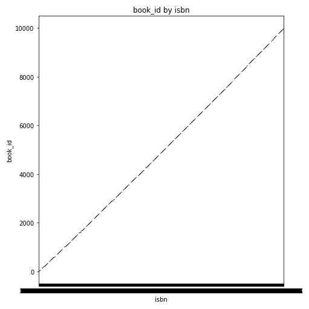
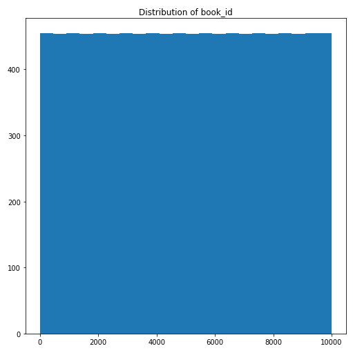

# Autolysis Data Analysis Report

# Data Analysis Story: Goodreads Dataset

## Dataset Overview

The dataset `goodreads.csv` consists of 10,000 observations, providing a comprehensive look into various books listed on Goodreads. It includes essential columns such as `book_id`, `goodreads_book_id`, `best_book_id`, and `work_id`, among others. The dataset contains 16 numeric columns and 7 categorical columns, highlighting various attributes of the books. Notably, there are no datetime columns present.

## Visualizations and Insights

### 1. Relationship Between `book_id` and `isbn`

The first visualization illustrates the relationship between `book_id` and `isbn`. The graph shows a linear relationship, indicative of the dataset’s structure where `book_id` is sequential from 0 to 9999. This suggests that each book in the dataset is uniquely identified and that there are no missing entries in this range.

### 2. Distribution of `book_id`

The second visualization presents the distribution of `book_id`. The histogram depicts a uniform distribution, indicating that the `book_id` values are evenly spread across the dataset. This uniformity reinforces the idea that each entry corresponds to a distinct book without any apparent biases toward certain IDs.

## Suggested Actions Based on Insights

The insights gleaned from this analysis can inform several potential actions:

1. **Data Validation**: The sequential nature of `book_id` suggests a well-maintained dataset. This can be leveraged for further data validation processes, ensuring data integrity and completeness.

2. **Data Enrichment**: The uniform distribution of `book_id` opens up avenues for integrating additional datasets. By cross-referencing with other bibliographic or sales data, one could enrich the information available about each book.

3. **Analysis of Book Popularity**: With the insights derived from numeric and categorical data, one could delve deeper into trends regarding book ratings, reviews, and genres, ultimately aiding in understanding what types of books are favored by readers.

4. **Recommendation Systems**: The analysis can contribute to developing recommendation algorithms by identifying popular genres or authors, thus enhancing user experience on platforms like Goodreads.

In conclusion, the analysis of the Goodreads dataset offers valuable insights into the structure and distribution of the data, laying the groundwork for further exploration and potential applications in the realm of literature and reading preferences.