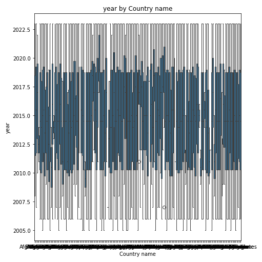
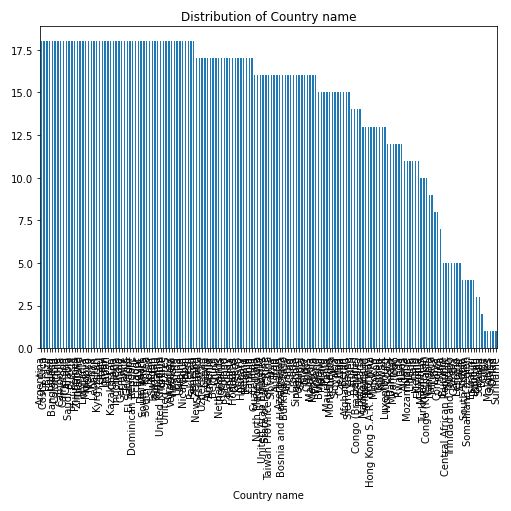

# Autolysis Data Analysis Report

# Analysis of the Happiness Dataset

## Dataset Overview

The dataset `happiness.csv` comprises **2,363 observations** focusing on various metrics related to happiness across different countries. It includes a mix of numeric and categorical columns, with **10 numeric columns** capturing factors such as the Life Ladder, Log GDP per capita, and Social support, and **1 categorical column** representing country names. Notably, there are no datetime columns, allowing for a straightforward analysis of the relationship between happiness indicators and countries across different years.

## Visualizations and Insights

### 1. Year by Country Name

The first visualization presents the relationship between the **year** and **country name**. The chart shows a dense distribution of data points across the years, indicating that many countries have been consistently tracked over time. The vertical lines suggest variations in happiness ratings within individual countries across different years. This visualization is essential for understanding trends in happiness over time and identifying countries with fluctuating levels of happiness.

### 2. Distribution of Country Names

The second visualization illustrates the **distribution of countries** based on their happiness scores. The chart reveals that a few countries have significantly higher happiness scores, while the majority fall towards the lower end of the distribution. This skewed distribution suggests a disparity in happiness levels globally, highlighting that certain regions or nations consistently perform better in terms of citizen satisfaction and well-being.

## Suggested Actions Based on Insights

The insights derived from this analysis could drive several initiatives:

1. **Policy Development**: Governments can use the happiness indicators to inform policy decisions aimed at improving citizen well-being. By identifying factors contributing to higher happiness scores, strategies can be developed to enhance social support and economic stability in lower-scoring countries.

2. **Further Research**: The trends observed in the visualizations can encourage additional research into the underlying factors affecting happiness. Investigating the socio-economic, cultural, and environmental influences may yield actionable insights.

3. **International Collaboration**: Countries with higher happiness ratings could share best practices with those struggling, fostering international collaboration and knowledge exchange focused on improving well-being.

4. **Public Awareness Campaigns**: Highlighting the disparities in happiness can raise awareness among citizens and policymakers, prompting discussions about mental health, social services, and quality of life improvements.

In conclusion, the analysis of the happiness dataset not only sheds light on the state of happiness across countries but also opens avenues for meaningful interventions and collaborations aimed at fostering a happier, healthier global community.