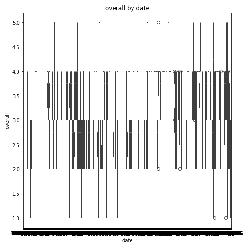
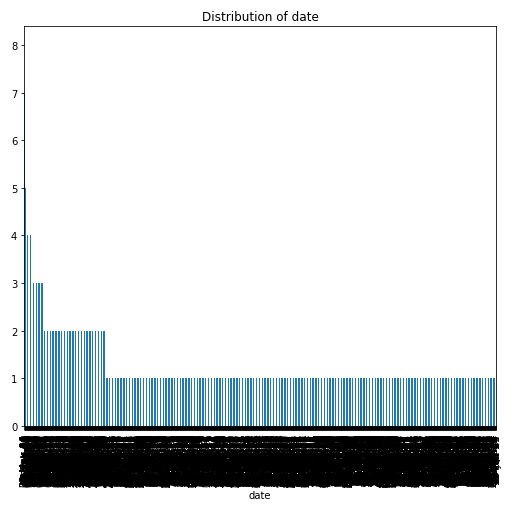

# Autolysis Data Analysis Report

# Data Analysis Story: Media Dataset Insights

## 1. Dataset Overview

The dataset **media.csv** consists of **2,652 observations** and contains various attributes related to media content. The dataset features a mix of **3 numeric columns** and **5 categorical columns**, providing a comprehensive view of media types, languages, titles, and other relevant metrics. Notably, there are no datetime columns, which may limit time-based analysis but allows for straightforward categorization and comparison of media data.

## 2. Visualizations and Insights

### Visualization 1: Overall Ratings by Date
The first visualization presents the **overall ratings by date**. It appears as a distribution of ratings across the dataset's entries. The plot showcases a range of ratings, with some instances of outliers. This suggests variability in the quality or reception of media content over time.

**Insights:**
- The ratings fluctuate significantly, indicating that some media received much higher ratings than others on specific dates.
- The presence of outliers may warrant further investigation to understand the factors contributing to these ratings.

### Visualization 2: Distribution of Media by Date
The second visualization illustrates the **distribution of media by date**. This histogram highlights the frequency of media entries across different dates.

**Insights:**
- There are peaks on certain dates, indicating periods where more media were released or recorded.
- The low frequency of entries on some dates suggests potential gaps in media coverage or data collection.

## 3. Suggested Actions Based on Insights

Given the insights derived from the visualizations, several actions can be taken:

- **Investigate Outliers:** Delve deeper into the dates and media associated with the highest ratings to understand what factors contributed to their success. This could inform future content creation strategies.
  
- **Enhance Media Capture:** Identify dates with low media entries and explore reasons for the gaps. This could lead to improved strategies for capturing a broader range of media content.

- **Temporal Analysis:** Even without explicit datetime columns, consider creating derived variables based on the existing date data to analyze trends over time more effectively. This could help in understanding seasonal patterns or shifts in audience preferences.

- **Targeted Content Strategy:** Using the insights from media distribution, plan content releases during peak periods to maximize visibility and engagement based on historical data.

By leveraging these insights, stakeholders can make informed decisions that enhance media strategy and optimize audience engagement.